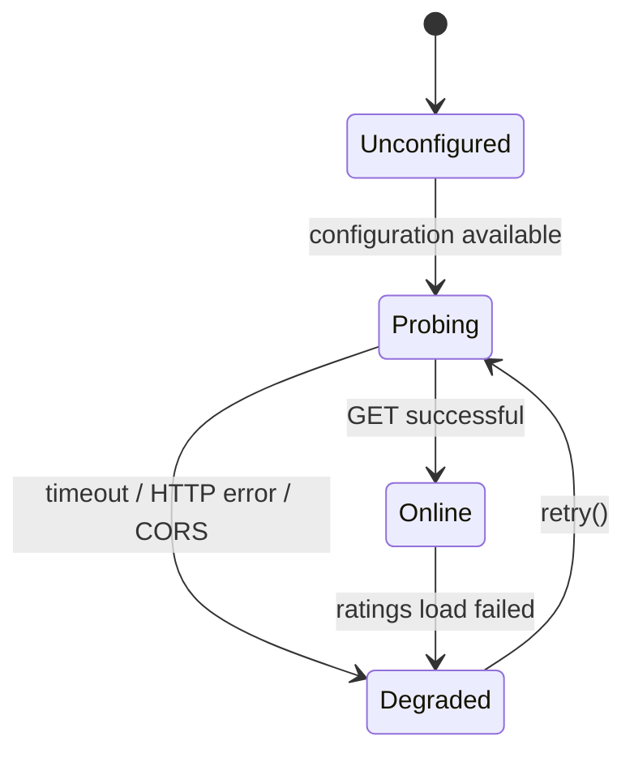

# WinMix Cloud Tier State Machine

## States

| State | Description |
|-------|-------------|
| **Unconfigured** | No valid Supabase URL or publishable key found in env or fallback. The cloud tier is dormant. |
| **Probing** | Configuration is available; a reachability probe is in flight. |
| **Online** | The endpoint responded successfully. Ratings can be loaded. |
| **Degraded** | A failure occurred (timeout, HTTP error, CORS, malformed response, RLS rejection). The cloud tier is sticky-degraded for the rest of the session. |

## Transitions

- **Unconfigured → Probing**: Triggered on app load when `readCloudEnv()` returns a valid config.
- **Probing → Online**: The REST probe (GET on `view_team_ratings` or REST root) returned 200.
- **Probing → Degraded**: The probe failed (network error, timeout, 401/403/429, or 404 on both attempts).
- **Online → Degraded**: A subsequent `loadRatings()` call failed (network error, validation error, HTTP error).
- **Degraded → Probing**: Only via explicit `retry()` call from the UI. There is **no automatic retry loop**.

## Key Rules

1. **Degraded is sticky** — once entered, the cloud tier stays degraded for the entire session unless the user explicitly clicks "Kapcsolat újrapróbálása".
2. **No automatic retries** — prevents HTTP 429 rate-limit cascades and unnecessary network requests.
3. **Offline-first** — WinMix continues normally in any cloud failure state. Only the cloud-related UI shows the degraded status.
4. **No pipeline impact** — cloud ratings are display/diff/audit only. They never feed into the prediction engine, joint score matrix, or bootstrap.
