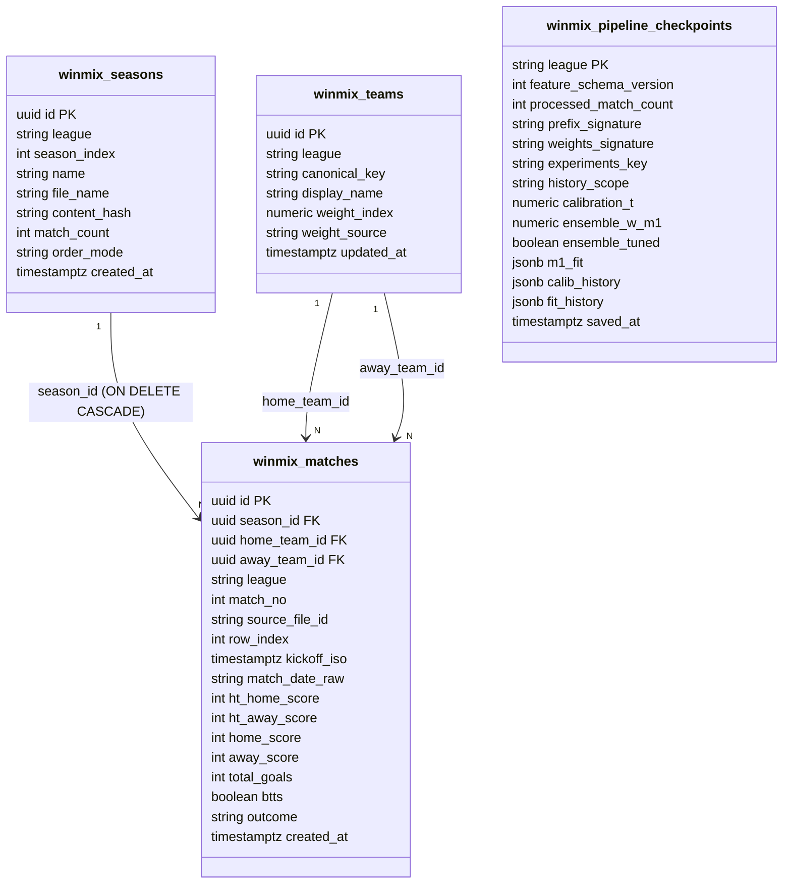

# WinMix Supabase ERD

## Constraints

- `winmix_teams`: UNIQUE(league, canonical_key), league IN ('angol','spanyol'), weight_index 0–10
- `winmix_seasons`: UNIQUE(league, season_index), order_mode IN ('chronological','source-order')
- `winmix_matches`: UNIQUE(season_id, match_no), HT ≤ FT check, generated columns for total_goals/btts/outcome
- `winmix_pipeline_checkpoints`: league is PK, history_scope IN ('season-only','league-cumulative')

## Security

- RLS enabled on all four tables
- SELECT-only policies for anon + authenticated (no INSERT/UPDATE/DELETE policies)
- GRANT SELECT to anon, authenticated; REVOKE write from anon, authenticated
- `view_team_ratings` uses `security_invoker = true`
- Only `service_role` (server-side) can write, bypassing RLS
